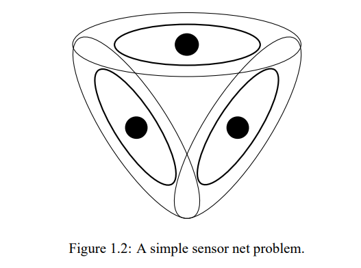
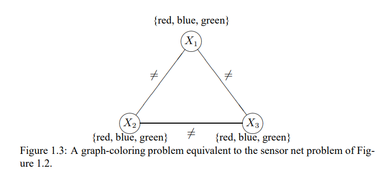

### **1.1. Defining distributed constraint satisfaction problems**
---

A **constraint satisfaction problem(CSP)** is definded by a set of variables, domains for each of the variables, and constraints on the values that the variables might take on simultaneously. The role of constraint satisfaction algorithms is to assign values to the variables in a way that is consistent with all the constraints, or to determine that no such assignment exists.

Constraint satisfaction techniques have been applied in diverse domains, including machine vision, natural language processing, theorem proving, and plannng and scheduling, to name but a few. Here is a simple example taken from the domain of sensor networks. Figure 1.2 depicts a three-sensor snippet from the scenario illustrated in Figure 1.1. Each of the sensors has a certain radius that, in combination whith the obstacles in the environment, gives rise to a particular coverage area. These coverage area are shown as ellipses in Figure 1.2. As you can see, some of the coverage areas overlap. We consider a specific problem in this setting. Suppose that each sensor can choose one of three possible radio frequencies. All the frequencies work equally well so long as no two sensors with overlapping converage areas use the same frequency. The question is which algorithms the sensors should employ to select their frequencies, assuming that this decision cannot be made centrally.

These essence of this problem can be captured as a graph-coloring problem. Figure 1.3 shows such a graph, corresponding to the sensor network SCP above. The nodes represent the individual units; the different frequencies are represented by colors; and two nodes are connected by an undirected edge if and only if the above coverage areas of the corresponding sensors overlap. The goal of graph coloring is to choose one color for each node so that no two adjacent nodes have the same color.

Formally speaking, a CSP consists of a finite set of variables X = {X1, ..., Xn}, a domain Di for each variable Xi, and a set of constraints {C1,..., Cm}. Although in general CSPs allow infinite domains, we assume here that all the domains are finite. In the graph-coloring example above there were three variables, and they each had the same domain, {red, green, blue}. Each such constraint restricts the values that may be simultaneously assigned to the variables participating in the constraint. In this chapter we restrict the discussion to binary constraints, each of which constraints exactly two variables. For example, in the map-coloring case, each "not-equal" constraint applied to two nodes.

Given a subset S of the variables, an instantiation of S is an assignment of a unique domain value for each variable in S; it is legal if it does not viloate any constraint that mentions only variables in S. A solution to a network is a legal instantiation of all variables. Typical tasks associated with constraint networks are to determine whether a solution exists, to find one or all solutions, to determine whether a legal instantiation of some of the variables can be extended to a solution, and so on. We will concentrate on the most common task, which is to find one solution to a CSP, or to prove that none exists.

In a distributed CSP, each variable is owned by a different agent. The goal is still to find a global variable assignment that meets the constraints, but each agent decides on the value of his own variable with relative autonomy. While he does not have a global view, each agent can communicate with his neighbors in the constraint graph. A distributed algorithm for solving a CSP has each agent engage in some protocol that combines local computation with communication with his neighbors. A good algorithm ensures that such a process terminates with a legal solution (or with a realization that no legal solution exists) and does so quickly.

We discuss two tpyes of algorithms. Algorithms of the first kind embody a least-commitment approach and attempt to rule out impossible variable values without losing any possible solutions. Algorithms of the second kind embody a more adventurous spirit and select tentative variable values, backtracking when those choices prove unsuccessful. In both case we assume that the communication between neighboring nodes is perfect, but nothing about its timing; messages can take more or less time without rhyme or reason. We do assume, however, that if node i sends multiple messages to node j, those messages arrive in the order in which they were sent.