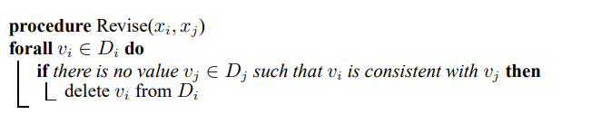
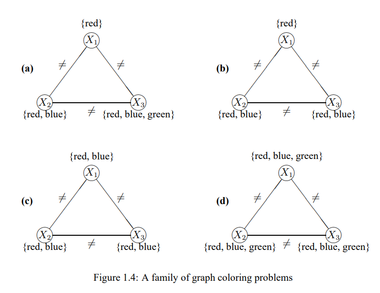
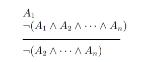
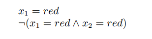
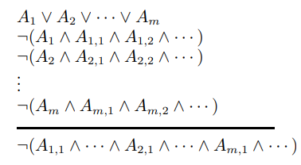
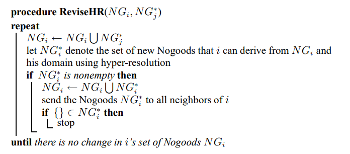
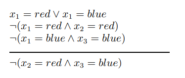
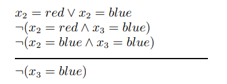

### **Domain-pruning algorithms**
---

Under domain-pruning algorithms, nodes communicate with their neighbors in order to eliminate values from their domains. We consider two such algorithms. In the first, the filtering algorithm, each node communicates its domain to its neighbors, eliminates from its domain the values that are not consistent with the values received from the neighbors, and the process repeats. Specifically, each node xi, with domain Di repeatdly executes the procedure **Revise**(xi, xj) for each neighbor xj.

The process, known also under the general term **arc consistency**, terminates when no further elimination takes place, or when one of the domains becomes empty (in which case the problem has no solution). If the process terminates with one value in each domain, that set of values consistutes a solution. If it terminates with multiple values in each domain, the result is inconclusive; the problem might or might not have a solution.

Clearly, the algorithm is guaranteed to terminate, and furthermore it is sound (in that if it announces a solution, or announces that no solution exists, it is correct), but it is not complete (i.e., it may fail to pronounce a verdict). Consider, for example, the family of very simple graph-coloring problems shown in Figure 1.4. (Note tat problem (d) is identical to the problem in Figure 1.3.)

In this family of CSPs the three variables (i.e., nodes) are fixed, as are the "not-equal" constraints between them. What are not fixed are the domains of the variables. Consider the four instances of Figure 1.4.

(a) Initially, as the nodes communicate with one another, only x1's messages result in any change. Specifically, when either x2 or x3 recieve x1's message they remove red from their domains, ending up with D2 = {blue} and D3 = {blue, green}. The, when x2 communicates his new domain to x3, x3 further reduces his domains to {green}. At this point no further changes take place and the algorithm terminates with a correct solution.

(b) The algorithm starts as before, but once x2 and x3 recieve x1's message they each reduce their domains to {blue}. Now, when they update each other on their new domains, they each reduce their domains to { }, the empty set. At this point the algorithm terminates and correctly announces that no solution exists.

(c) In this case the initial set of messages yields no reduction in any domain. The algorithm terminates, but all the nodes have multiple values remaining. And so the algorithm is not able to show that the problem is overconstrained and has no solution.

(d) Filtering can also fail when a solution exists. For similar reasons as in instace (c), the algorithm is unable to show that in this case the problem does have a solution.

In general, filtering is a very weak method and, at best, is used as a preprocessing step for more sophisticated methods. The algorithm is directly based on the notion of unit resolution from propositional logic. Unit resolution is the following inference rule:

To see how the filtering algorithm corresponds to unit resolution, we must first write the constraints as forbidden value combinations, called Nogoods. For example, the constraint that x1 and x2 cannot both take the value "red" would give rise to the prpositional sentence -(x1 = red ^ x2 = red), which we write as the Nogood {x1, x2}. In instance (b) of Figure 1.4, agent X2 updated his domain based on agent X1's announcement that x1 = red and the Nogood {x1 = red, x2 = red}.

Unit resolution is a weak inference rule, and so it is not surprising that the filtering algorithm is weak as well. Hyper-resolution is a generalization of unit resolution and has the following form:

Hyper-resolution is both sound and complete for propositional logic, and indeed it gives rise to a complete distributed CSP algorithm. In this algorithm, each agent repeatedly generates new constraints for his neighbors, notifies them of these new constraints, and prunes his own domain based on new constraints passed to him by his neighbors. Specifically, he executes the following algorithm, where N Gi is the set of all Nogoods of which agent i is aware and NG*j is a set of new Nogoods communicated from agent j to agent i.

The algorithm is guaranteed to converge in the sence that after sending and receiving a finite number of messages, each agent will stop sending messages and generating Nogoods. Furthermore, the algorithm is complete. The problem has a solution iff, on completion, no agent has generated the empty Nogood. (Obviously, very superset of a Nogood is also forbidden, and thus if a single node ever generates an empty Nogood then the problem has no solution.)

Consider again instance (c) of the CSP problem in Figure 1.4. In constrast to the filtering algorithm, the hyper-resolution-based algorithm proceeds as follows. Initially, x1 maintains four Nogoods --{x1 = red, x2 = red}, {x1 = red, x3 = red}, {x1 = blue, x2 = blue}, {x1 = blue, x3 = blue} --which are derived directly from the cosntraints involving x1. Furthermore, x1 must adopt one of the values in his domains, so x1 = red V x1 = blue. Using hyper-resolution, x1 can reason:

Thus, x1, constructs the new Nogood {x2 = red, x3 = blue}; in a similar way he can also construct the Nogood {x2 = blue, x3 = red}. x1 then sends both Nogoods to his neighbors x2 and x3. Using his domain, an existing Nogood and one of these new Nogoods, x2 can reason:

Using the other new Nogood from x1, x2 can also construct the Nogood {x3 = red}. These two singleton Nogoods are communicated to x3 and allow him to generate the empty Nogood. This proves that the problem does not have a solution.

This example, while demonstrating the greater power of the hyper-resolution-based algorithm relative to the filtering algorithm, also exposes its weakness; the number of Nogoods generated can grow to be unmanagebly large. (Indeed, we only described the minimal number of Nogoods needed to derive the empty Nogood; many other would be created as all the agents processed each other's messages in parallel. Can you find an example?) Thus, the situation in which we find ourselves is that we have one algorithm that is too weak and another that is impracratical. The problem lies in the least-commitment nature of these algorithm; they are restricted to removing only provably impossible value combinations. The alternative to such "safe" procedures is to explore a subset of the space, making tentative value selections for variables, and backtracking when necessary. This is the topic of the next section. However, the algorithms we have just described are not irrelevent; the filtering algorithm is an effective preprocessing step, and the algorithm we discuss next is based on the hyper-resolution-based algorithm.