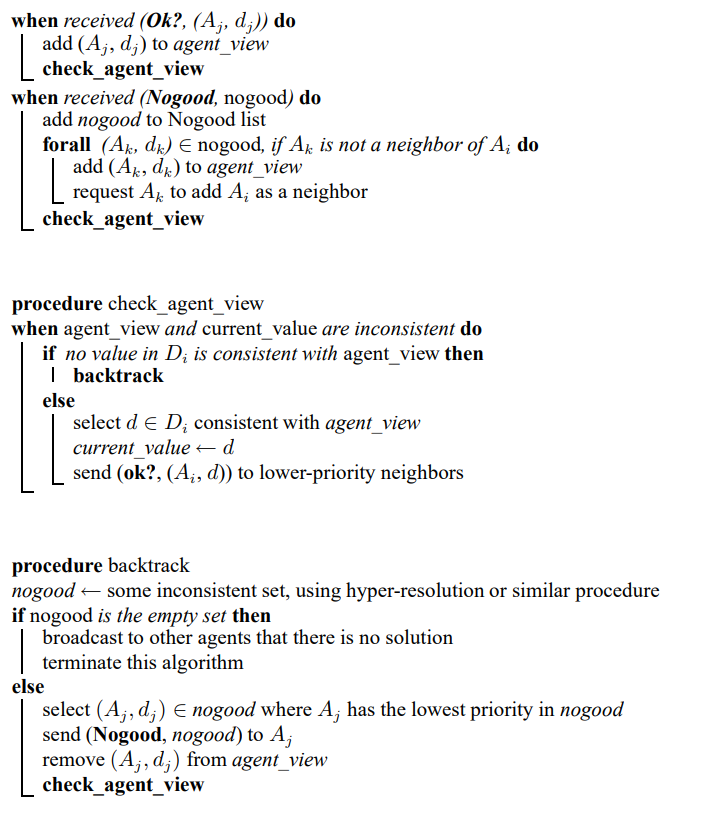
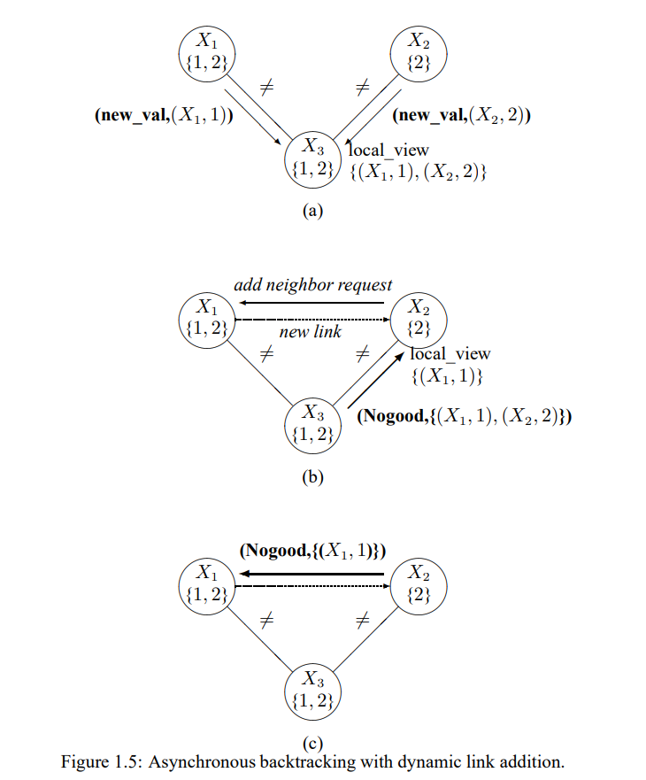
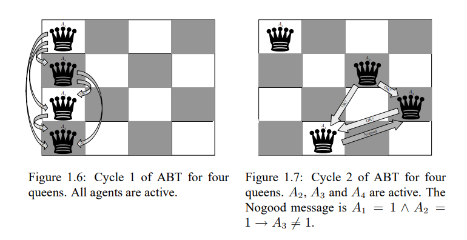
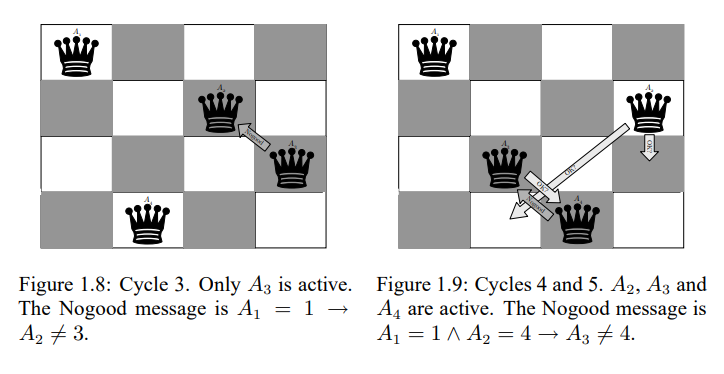
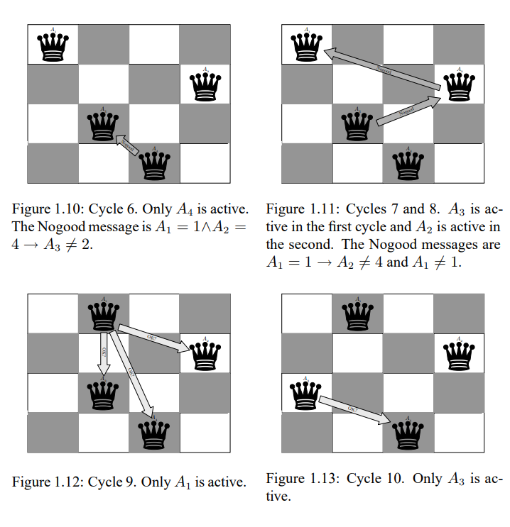

### **Heuristic search algorithms**
---

A straightforward centralized trail-and-error solution to a CSP is to first order the variables (e.g., alphabetically).
Then, given the ordering x1, x2, ..., xn, invoke the procedure ChooseValue(x1, {}). The procedure ChooseValue is defined 
recursively as follows, where {v1, v2, ..., vn-1} is the set of values assigned to variables x1, ...., xi-1.

```
procedure ChooseValue(xi, {v1, v2, ..., vi-1})
vi <- value from the domain of xi, that is consistent with {v1, v2, ..., vi-1}

if no such value exists then
 |  backtrack^1
else if i = n then
 |  stop
else
    ChooseValue(xi+1, {v1, v2, ..., vi})
```

This exhausive search of the space of assignments has the advantage of completeness. But it is "distributed" only in the 
uninteresting sence that the different agents execute sequentially, mimicking the execution of a centralized algorithm.

This following attempt at a distributed algorithm has the opposite properties: it allows the agents to execute in parallel and asynchronously, is sound, but is not complete. Consider the following naive procedure, executed by all agents in parallel and asynchronously.

```
select a value from your domain
repeat
|   if your current value is consistent with the current value of your
|   neighbors, or if none of the values in your domain are consistent with
|   them then
|    |  do nothing
|    else
|    |  select a value in your domain that is consistent with those of your
|    |  neighbors and notify your neighbors of your new value
until there is no change in your value
```

Clearly, when the algorithm terminates because no constraint violations have occurred, a solution has been found. But in all 
other cases, all bets are off. If the algorithm terminates because no agent can find a value consistent with those of his 
neighbors, there might still be a consistent global assignment. And the algorithm may never terminate even if there is a solution. For example, consider example (d) of Figure 1.4: if every agent cycles sequentially between red, green, and blue, the alrogithm will never terminate.

We have given these two straw-man algorithms for two reasons. Our first reason is to show that reconciling true parallelism and asynchrony with soundness and completeness is likely to require somewhat complex alrogithms. And second, the fundamental heuristic algorithm for distributed CSPs-the asynchronous  backtracking(or ABT) algorithm-shares much with the two alrogithms.
From the first alrogithm it borrows the notion of a global total ordering on the agents. From the second it borrows a message-passing protocol, albeit a more complex one, which relies on the global ordering. We will describe the ABT in its simplest form. After demonstrating it on an extended example, we will point to ways in which it can be improved upon.


#### **The asynchronous backtracking algorithm**
---

As we said, the asynchronous backtracking (ABT) alrogithm assumes a total ordering (the "priority order") on the agents. Each binary constraint is known to both the constrained agents and is checked in the algorithm by the agent with the lower priority between the two. A link in the constraint network is always directed from an agent with higher priority to an agent with lower priority.

Agents instantiate their variables concurrently and send their assigned values to the agents that are connected to them by outgoing links. All agents wait for and respond to messages. After each update of his assignment, an agent sends his new assignment along all outgoing links. An agent who recieves an assignment (from the higher-priority agent of the link), tries to find an assignment for his variable that does not violate a constraint with the assignment his received.

ok? messages are messages carrying an agent's variable assignment. When an agent Ai receives an ok? message from agent Aj, Ai places the received assignment in a data structure called agent_view, which holds the last assignment Ai received from higher-priority neighbors such as Aj. Next, Ai checks if his current assignment is still consistent with his agent_view. If it is consistent, Ai does nothing. If not, Ai searches his domain for a new consistent value. If he finds one, he assigns his variable that value and sends ok? messages to all lower-priority. Otherwise, Ai backtracks.

The backtrack operation is executed by sending a Nogood message. Recall that a Nogood is simply an inconsistent partial assigment, that is, assignments, that is, assignments of specific values to some of the variables that together violate the constraints on those variables. In this case, the Nogood consistent of Ai's agent_view.^2 The Nogood is sent to the agent with the lowest priority among the agents whose assignments are included in the consistent tuple in the Nogood. Agent Ai whe sends a Nogood message to agent Aj assumes that Aj will change his assignment. Therefore, Ai removes from his agent_view the assignment of Aj and makes an attempt to find an assignment for Aj's variable that is consistent with the updated agent_view.

Because of its reliance on building up a set of Nogoods, the ABT algorithm can be seen as a greedy version of the hyper-resolution algorithm of the previous section. In the letter, all possible Nogoods are generated by each agent and communicated to all neighbors, even though the vast majority of these messages are not useful. Here, agents make tentative choices of a value for their variables, only generate Nogoods that incorporate values already generated by the agents above them in the order, and -importantly-communicate new values only to some agents ane new Nogoods to only one agent.

Below is the pseudocode of the ABT algorithm, specifying the protocol for agent Ai.



Notice a certain wrinkle in the pseudocode, having to do with the addition of edges. Since the Nogood can include assignments of some agent Aj, which Ai was not previously constrained with, after adding Aj's assignment to its agent_view Ai sends a message to Aj asking it to add Ai to its list of outgoing links. Furthermore, after adding the link, Aj sends an ok? message to Ai each time it reassigns its variable. After storing the Nogood, Ai checks if its assignment is still consistent. If it is, a message is sent to the agent the Nogood was received from. This resending of the assignment is crucial since, as mentioned earlier, the agent sending a Nogood assumes that the receiver of the Nogood replaces its assignment. Therefore it needs to know that the assignment is still valid. If the old assignment that was forbidden by the Nogood is inconsistent, Ai tries to find a new assignment to the case when an ok? message is received.


#### **A simple example**
---

In Section 1.3.3 we give a more elaborate example, but here is a brief illustration of the operation of the ABT algorithm on one of the simple problems encountered earlier. Consider again the instance (c) of the CSP in Figure 1.4, and assume the agents are ordered alphabetically: x1, x2, x3. They initially select values at random; suppose they all select blue. x1 notifies x2 and x3 of his choice, and x2 notifies x3. x2's local view is thus {x1 = blue}, and x3's local view is {x1 = blue, x2 = blue}. x2 and x3 must check for consistency of their local views with their own values. x2 detects the conflict, changes for consistency and similarly changes his x3. In the meantime, x3 also checks for consistency and similarly  chagnes his value to red; he, however, notifies no one. Then x3 receives a second message from x2, and updates his local view to {x1 = blue, x2 = red}. At this point he cannot find a value from his domain consistent with his local view, and, using hyper resolution, generates the Nogood {x1 = blue, x2 = red}. He communicates this Nogood to x2, the lowest ranked agent participating in the Nogood. x2 now cannot find a value consistent with his local view, generates the Nogood {x1 = blue}, and communicates it to x1. x1 detects the inconsistency with his current value, changes his value to red, and communicates the new value to x2 and x3. The process now continuous as before; x2 changes his value back to blue, x3 finds no consistent value and generate the Nogood {x1 = red, x2 = blue}, and then x2 generates the Nogood {x1 = red}. At this point x1 has the Nogood {x1 = blue} as well as the Nogood {x1 = red}, and using hyper-resolution he generates the Nogood {}, and the algorithm terminates having determined that the problem has no solution.

The need for the addition of new edges is seen in a slightly modified example, show in Figure 1.5.

As in the previous example, here too x3 generates the Nogood {x1 = blue, x2 = red} and notifies x2. x2 is not able to regain consistency by changing his own value. However, x1 is not a neighbor of x2, and so x2 does not have the value x1 = blue in his local view and is not able to send the Nogood {x1 = blue} to x1. So x2 sends a request to x1 to add x2 to his list of neighbors and to send x2 his current value. From there onward the algorithm proceeds as before.




#### **An extended example: the four queens problem**
---



In order to gain additional feeling for the ABT algorithm beyond the didactic example in the previous section, let us look at one of the canonical CSP problems: the n-queens problem. More specifically, we will consider the four queens problem, which asks how four queens can be placed on a 4 x 4 chessboard so that no queen can (immediately) attack any other. We will describe ABT's behavior in terms of cycles of computation, which we somewhat artificially define to be the receiving messages, the computations triggered by received messages, and the sending of messages due to these computations.

In the first cycle (Figure 1.6) akk agents select values for their variables, which represent the positions of their queens along their respective rows. Arbitrarily, we assume that each begins by positioning his queen at the first square of his row. Each agent 1, 2, and 3 sends ok? messages to the agents ordered after him: A1 sends three messages, A2 sends two, and agent A3 sends a single message. Agent A4 does not have any agent after him, so he sends no messages. All agents are active in this first cycle of the algorithm's run.

In the second cycle (Figure 1.7) agents A2, A3 and A4 receive the ok? messages sent to them and proceed to assign consistent values to their variables. Agent A3 assign consistent values to their variables. Agent A3 assigns the value 4 that is consistent with the assignments of A1 and A2 that he receives. Agent A4 has no value consistent with the assignments of A1, A2 and A3, and so he sends a Nogood containing these three  from his agent_view. Then, hs assigns the value 2 which is consistent with the assignments that he recieved from A1 and A2 (having erased the assignment of A3, assuming that it will be replaced because of the Nogood message). The active agent in this cycle are A2, A3, and A4. Agent A2 acts according to his information about A1's position and moves to square 3, sending two ok? messages to inform his successors about his value. As can be seen in Figure 1.7, A3 has moved to square 4 after receiving ok? messages of agents A1 and A2. Note that agent A3 thinks that these agents are still in the first column of their respective rows. This is a manifestation of concurrency that causes each agent to act at all times in a form that is based only on his Agent_View. The Agent_View of agent A3 includes the ok? messages he received.

The third cycle is described in Figure 1.8; only A3 is active. After receiving the assignment of agent A2, A3 sends back a Nogood message to agent A2. He then erases the assignment of agent A2 from his Agent_View and validates that his current assignment (the value 4) is consistent with the assignment of agent A1. Agent A1 and A2 continue to be idle, having received no messages that were sent in cycle 2. The same is true for agent A4. Agent A3, also receiveds the Nogood sent by A4 in cycle 2 but ignores it since it includes an invalid assignment for A2 (i.e., (2, 1) and not the currently correct (2, 4)).



Cycles 4 and 5 are depicted in Figure 1.9. In cycle 4 agent A2 moves to square 4 because of the Nogood message he received. His former value was ruled out and the new value is the next valid one. He informs his successors A3 and A4 of his new position by sending two ok? messages. In cycle 5 agent A3 receives agent A2's new position and selects the only value that is compatible with the positions of his two predecessors, square 2. He sends a message to his successor informing him about this new value. Agent A4 is now left with no valid to assign and sends a Nogood message to A3 that includes all his conflicts. The Nogood message appears at the bottom of Figure 1.9. Note that the Nogood message is no longer valud. Agent A4, however, assumes that A3 will change his position and moves to his only valid position (given A3's anticipated move) - column 3.

Consider now cycle 6. Agent A4 receives the new assignment of agent A3 and sends him a Nogood message. Having erased the assignment of A3 after sending the Nogood message, he then decides to stay at his current assignment (column 3), since it is compatible with the position of agent A1 and A2. Agent A3 is idle in cycle 6, since he receives no messages from either agent A1 or agent A2 (who are idle too). So, A4 is the only active agent at cycle 6 (see Figure 1.10).



In each of cycles 7 and 8, one Nogood is sent. Both are depicted in Figure 1.11. First, agent A3, after receiving the Nogood message from A4, finds that he has no valid values left and sends a Nogood to A2. Next, in cycle 8, agent A2 also discover that his domain of values is exhausted and sends a Nogood message to A1. Both sending agents erase the values of their successors (to whom the Nogood messages were sent) from their agent_views and therefore remain in their positions, which are now conflict free.

Cycle 9 involves only agent A1, who receives the Nogood message from A2 and so moves to his next value - square 2. Next, he sends ok? messages to his there successors.

The final cycle is cycle 10. Agent receives the ok? message of A1 and so moves to a consistent value - square 1 of his row. Agents A2 and A4 check their Agent_Views after receiving the same ok? message from agent A1 and find that their current values are consistent with the new position of A1. Agent A3 sends an ok? message to his successor A4, informing of his move, but A4 finds no reason to move. His value is consistent with all value assignments of all his predecessors. After cycle 10 all agents remain idle, having no constraint violations with assignments on their agent_views. Thus, this is a final state of the ABT algorithm in which it finds a solution.