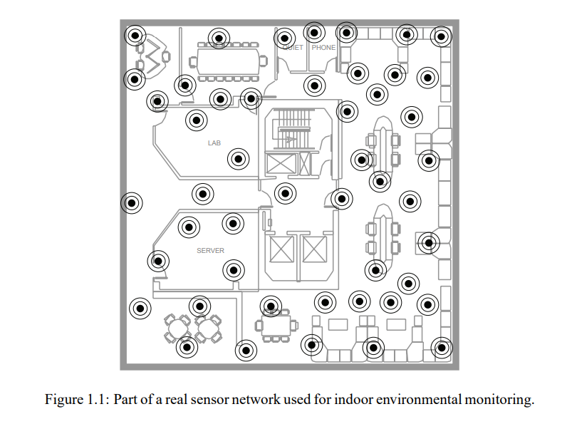

## **1**
---
### **Distributed Constrained Satisfaction**

In this chapter and the next we discuss cooperative situations in which agents collaborate to achieve a common goal.
This goal can be viewed as shared between the agents or, alternatively, as the goal of a central designer who is
designing the various agents. Of course, if such a designer exists, a natural question is why it matters that there
are multiple agents; they can be viewed merely as end sensors and effectors for executing the plan devised by the 
designer. However, there exist situations in which a problem needs to be solved in a distributed fashion, either
because a central controller is not feasible controller is not feasible or because one wants to make good use of the 
distributed resources. A good example is provided by **sensor networks**. 

Such networks consist of multiple processing units, each with local sensor capabilities, limited processing power, 
limited power supply, and limited communication bandwidth. Despite these limitations, these networks aim to provide
some global service. Figure 1.1 shows an example of a fielded sensor network used for monitoring environmental quantities
like humidity, temperature and pressure in an office environment. Each sensor can monitor only its local area and, similarly,
can communicate only with other sensors in its local vicinity. The question is what algorithm the individual sensors should run so that the center can still piece together a reliable global picture.

Distributed algorithms have been widely studied in computer science. We concentrate on distributed problem-solving algorithms of the sort studied in artificial intelligence. We divide the discussion into two parts. In this chapter we cover distributed constraint satisfaction, where agents attempt in a distributed fashion to find a feasible solution to problem with global constraints. In the next chapter we look at agents who try not to satisfy constraints, but also to optimize some objective function subject to these constraints.

